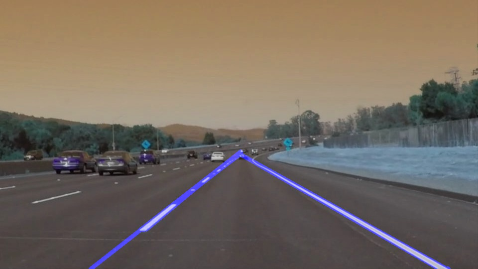

# **Finding Lane Lines on the Road** 

## Writeup Template

### You can use this file as a template for your writeup if you want to submit it as a markdown file. But feel free to use some other method and submit a pdf if you prefer.

---

**Finding Lane Lines on the Road**

The goals / steps of this project are the following:
* Make a pipeline that finds lane lines on the road
* Reflect on your work in a written report

[//]: # (Image References)

[image1]: ./examples/grayscale.jpg "Grayscale"

---

### Reflection

### 1. Describe your pipeline. As part of the description, explain how you modified the draw_lines() function.

My pipeline (`pipeline()`) consists of 5 steps
1. Grayscale
1. Canny
1. Region selection
1. Line detection via Hough transformation
1. Overlaying the identified lines on the original image

#### About my `draw_lines()`
To extrapolate the left/right lines, I had to first calculate the slope (m) and the intercept (b), then draw a new line that reaches the bottom of the screen (y = 540 in this case). I calculated those values as following:

    m = (y2 - y1)/(x2 - x1)
    b = y2 - (m * x2)

To actually draw the extended lines, I first identified the **longest** lines of left/right side, to make my algorithm more stable. I calculated the slop and the intercept for each side, then use them to draw the lines. The example shows that my algorithm successfully draws a continuous line in the **left side**.

### 2. Identify potential shortcomings with your current pipeline

1. Hard to cope with the curves in long distance, since I only use strait lines.
1. My algorithm is not stable in the upper part. Tends to draw trivial, unncessary lines across left/right side. 
   - I tried to solve this but couldn't.

### 3. Suggest possible improvements to your pipeline

1. Could use more flexible form of lines other than straight ones.
